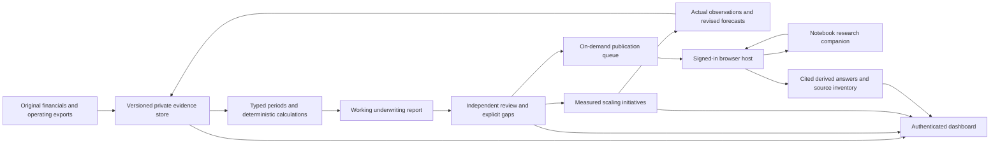

# BusinessOS underwriting and scaling delivery plan

## Product decision

BusinessOS owns evidence versions, calculations, decisions, operating plans, and measured outcomes. Notebook is an optional research interface over those materials. It helps people find explanations and questions; its answers remain derived analysis. A notebook outage must never block a financial calculation or an operating review.

Success means faster evidence-backed decisions and better cash outcomes, not more agent activity. The system must preserve the distinction between historical results, seller forecasts, analyst assumptions, independently verified facts, and unresolved questions.

## Architecture

The implementation uses a per-company SQLite store and immutable source blobs, a Python loopback API, and the existing Next.js dashboard. It preserves the prior Hermes gateway and version 1 validators. It does not install autonomous acquisition or customer-facing execution.

## Delivered in this branch

| Workstream | Implementation | Acceptance evidence |
|---|---|---|
| Evidence | Hashes, versions, original downloads, precise text/cell/page locations, missing-cache/OCR handling, provenance | Duplicate ingestion, changed-source invalidation, integrity and company-isolation tests |
| Underwriting | Decimal calculations, actual/forecast periods, contiguous actual LTM, fiscal-year checks, adjustment tests, reconciliations, working capital and scenario calculations | Financial regression tests, explicit missing-data errors |
| Construction | Cost-to-cost WIP, expected contract losses, billing/collection diagnostics, construction coverage requirements | WIP loss and missing-cost tests; input confirmation never represented as independent certification |
| Decisions | Immutable report inputs, working/conditional readiness, distinct reviewer role, disclosed gaps, memo export | Self-approval and undisclosed-exception rejection tests |
| Scaling | Baseline/target/owner/costs, ramped cash scenarios, capacity and benefit-overlap checks, saved projections, initiative observations and lifecycle | Cash-ramp, funding-gap, persistence and pre-acquisition authority tests |
| Dashboard | Five live views, authentication, same-origin writes, private API proxy, no sample-data fallback | Production build, demo smoke and live round-trip checks |
| Notebook | Read/ask/publish queue, exclusive claim, adapter, identity/citation/content checks, duplicate suppression, uncertain state | Synthetic adapter tests; a live read observation of the selected notebook's 16 sources |
| Operations | Local Windows launcher, encrypted local credentials, migration instructions, CI checks | PowerShell parse check and isolated runtime/dashboard tests |

The personal Notebook adapter needs a trusted browser host for each requested job. Queuing a job does not execute it. Live question-answer completion and publication have not been certified by this delivery; publication requires an independently reviewed report and full resulting-source verification. The current pasted-text import dialog was inspected without uploading a report.

## Underwriting workflow

1. Define company identity, fiscal calendar, currency, accounting basis, purchase scope, and industry.
2. Ingest originals and reconcile the document inventory. Preserve originals even when Notebook contains converted text copies.
3. Extract and review financial inputs. Missing values remain unknown; preserve formulas separately from cached values.
4. Build annual, YTD, actual LTM and forecast periods separately. Test every proposed add-back for recurrence, replacement cost, source support and period applicability.
5. Reconcile books to tax, bank, debt and operating records. Establish normalized working capital and debt-like items without assuming all balance-sheet balances transfer.
6. For construction, reconcile job costs, WIP, retainage, billing, collections, change orders, backlog cost-to-complete and bonding/capacity.
7. Calculate base/downside/upside cash, debt-service capacity and valuation only from explicit assumptions. Distinguish enterprise value from equity proceeds.
8. Produce the decision memo first: recommendation, evidence, risks, mitigations, missing items, conditions and scenario assumptions.
9. Have a separate reviewer inspect the exact inputs and originals. A conditional report must enumerate every unresolved gap. Approval of analysis is not authority to purchase.
10. Publish an approved report to Notebook on demand; retain the returned source ID, timestamp, content identity and processing evidence. Never use that report as corroboration of its own inputs.

## Scaling workflow

Begin with cash collection, job/product margin, capacity and customer retention. Prioritize initiatives using measurable expected cash benefit, implementation cost, available owner/team hours and evidence quality. Quantify acquisition cost or demand generation only after the underlying contribution economics and fulfillment capacity are established.

Each initiative requires an accountable owner, baseline, target, measurement period, source references, cost assumptions, benefit group, ramp, stop condition and rollback. Use proposed → shadow → pilot → active → closed/stopped. Pilot and active promotion require measured evidence, an independent reviewer and transition/operating stage. The software records those decisions; external execution still requires a separately implemented connector and action authority.

Track forecast versus actual cash and operating metrics. Investigate misses before increasing spend. Re-estimate remaining benefits from observed outcomes; prevent two initiatives from claiming the same cash improvement. The current overlap check uses explicit benefit groups, so reviewers must assign groups accurately.

## Pilot and rollout gates

| Gate | Work and owner | Completion criterion |
|---|---|---|
| Local pilot | Analyst/operator imports the actual company sources | Source inventory, dates, basis, provenance and exclusions reviewed |
| Decision readiness | Finance reviewer/QoE specialist | Cash/WIP/book reconciliation, supported earnings bridge, purchase scope and explicit exceptions |
| Notebook round trip | Operator with signed-in browser and reviewed memo | Query returns captured citations; published source has the exact report content and completed processing; retry creates no duplicate |
| Operating pilot | Operating lead and reviewer | Sourced baseline, realistic costs/capacity, measured shadow results, limited pilot and rollback |
| Remote deployment | Deployment owner | HTTPS/identity, private storage permissions, backup/restore drill, monitoring and live end-to-end checks |
| Provider connections | Operator selects accounting/banking/CRM providers | Least-privilege OAuth, per-company isolation, incremental sync, reconciliation, revoke/reconnect tests |
| Portfolio expansion | Portfolio lead | Repeatable company provisioning, separate identities/storage, evaluated cross-company aggregate reporting |

Direct provider OAuth, scheduled browser workers, OCR processing, production identity management, automated backups, and external business execution remain rollout work. They are not implied by green unit tests or by adding credentials.

## Efficiency and outcome measurement

Establish a baseline on a small set of representative historical deals before setting numerical improvement targets. Measure analyst minutes to a supported memo, time spent resolving missing evidence, unsupported-claim rate, arithmetic error rate, unresolved reconciliation differences, report rework and cost per accepted report. The runtime already records extraction time, cache hits and events; automated reviewer/outcome evaluation remains a follow-on measurement task.

For scaling, measure realized incremental cash after costs, gross/contribution margin, collection days, capacity utilization, retention, implementation hours and adverse effects. Compare initiative outcomes with the stated baseline and period, rather than assuming before/after changes were caused by the initiative. Stop or redesign initiatives that breach their stop conditions.

Use small, cheaper extraction/classification steps only where they preserve evidence quality. Cache by content and report input hash. Recalculate only affected report versions after a source change. Keep deterministic finance outside model prompts and call Notebook only for a specific research question or publication request.

## Handoff

See [the runtime guide](deployment/evidence-runtime.md) for installation, role credentials, browser-host contract, recovery and test commands. See [the input reference](underwriting/runtime-input.md) for report and operating-model input formats. Company data and credentials stay under ignored private instance paths and are not part of the reusable repository.
