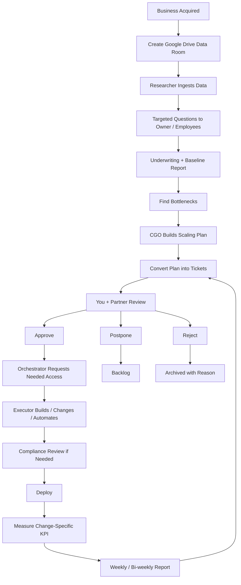
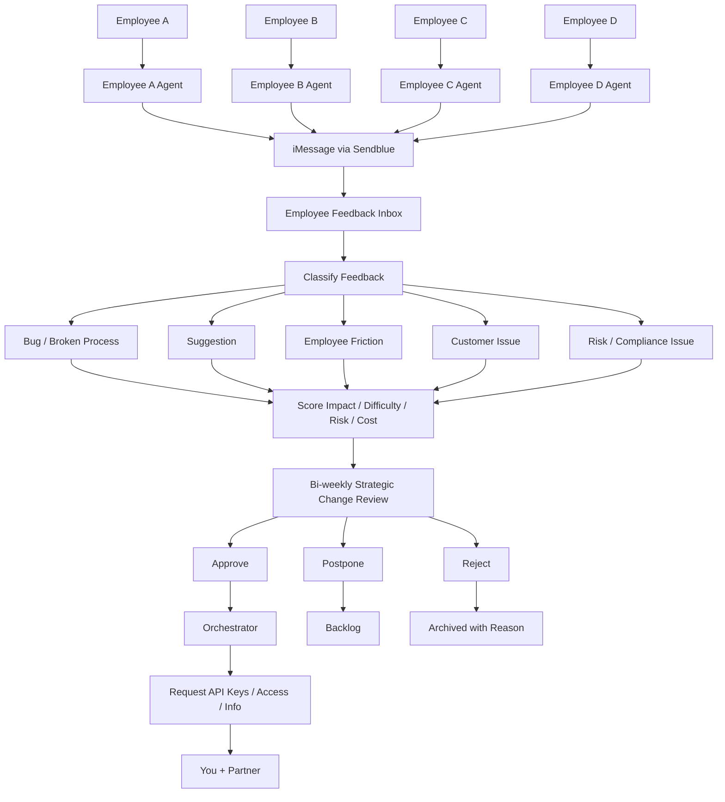

# System Structure

## Mental Model

The Google Drive data room stores source documents.

The Business Pod stores operating memory and execution control.

Hermes uses this pod to understand the business, coordinate agents, propose work, request approval, execute approved tickets, and report outcomes.

## Default Flow

## Employee Signal Flow

## Strategic Change Review Output

The bi-weekly output is a Strategic Change Review, not just an employee feedback queue.

It should include:

1. Employee feedback summary.
2. Customer friction summary.
3. Operational bottlenecks.
4. Growth bottlenecks.
5. Marketing opportunities.
6. Sales opportunities.
7. SEO opportunities.
8. Outreach opportunities.
9. Automation opportunities.
10. Fundamental changes.
11. Non-fundamental changes.
12. Agent/profile creation proposals.
13. Approved/postponed/rejected queue.
14. KPI movement since last review.
15. What the orchestrator needs from you.
16. Operational inefficiency radar findings.
17. Automation/system-building opportunities.
18. Documented anomalies and recurring patterns.
19. Quality/eval status for active initiatives.
20. Tool/API/permission blockers.

## Fundamental Changes

- Change pricing.
- Change offer.
- Change target customer.
- Change sales process.
- Add or remove service line.
- Hire, fire, or restructure role.
- Change core workflow.
- Replace core software.
- Change acquisition channel strategy.

## Non-Fundamental Changes

- Build dashboard.
- Improve CRM flow.
- Add email sequence.
- Add SEO pages.
- Improve intake form.
- Add reporting.
- Automate reminders.
- Clean database.
- Create SOP.
- Improve employee utility.

## Operating Systems

Hermes should use:

- `growth-system/` to detect and execute growth/automation initiatives.
- `operations-system/` to find waste, inefficiencies, and automatable workflows.
- `memory-system/` to document communications and signals.
- `quality-system/` to evaluate, test, simulate, approve, ship, and monitor changes.
- `intelligence-stack/` to run Edge Digital Twins, organizational drag scoring, sensing, and learning loops.
